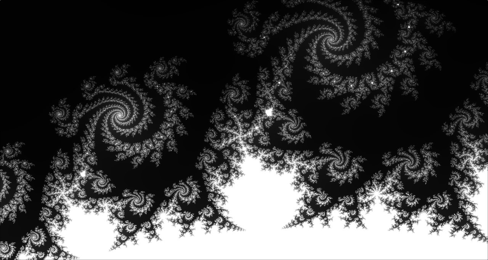
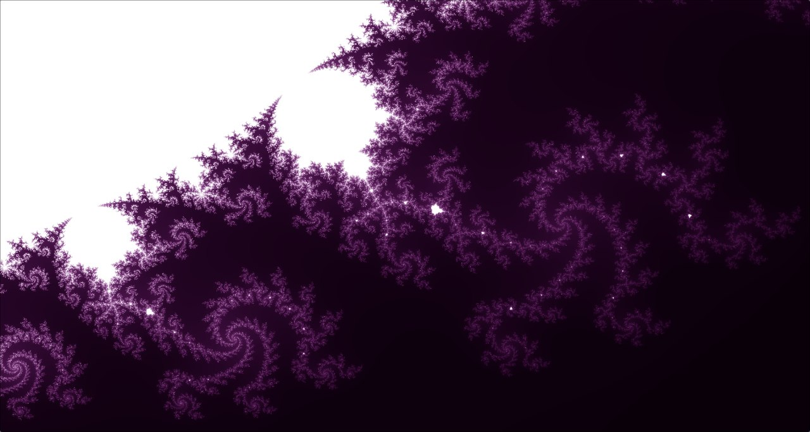

# Mandelbrot Viewer

An interactive viewer of the Mandelbrot set in C++ and OpenGL.

The project includes:
- smoothly scale a fractal (zoom to cursor position)
- pan the scene by dragging the mouse
- explore the structure of a set in real time

## Control

- Mouse wheel - zoom (to cursor)
- LMB + movement - panning
- `Q` or `Esc` - exit

## Screenshots





## Dependencies

To build the project you will need:

- C++17
- OpenGL
- GLFW
- GLAD

On Ubuntu / Debian:

```bash
sudo apt update
sudo apt install build-essential cmake libglfw3-dev
```

## Building and launching

```bash
git clone https://github.com/TimTim3101/mandelbrot.git
cd mandelbrot

mkdir build
cd build
cmake ..
make
./mandelbrot
```
